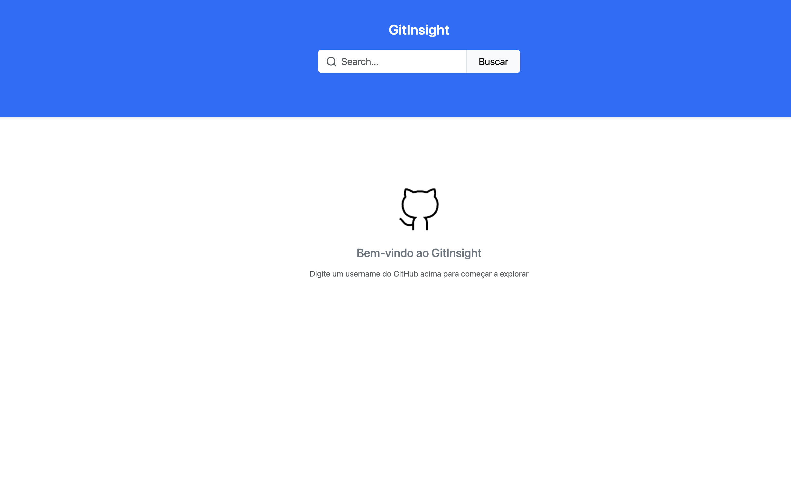
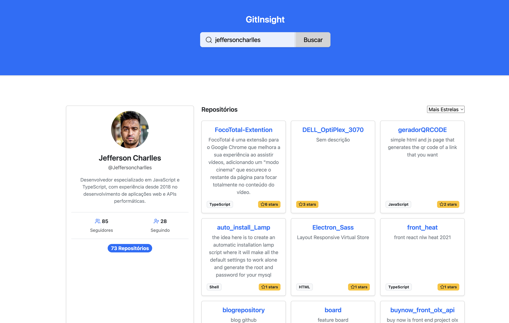
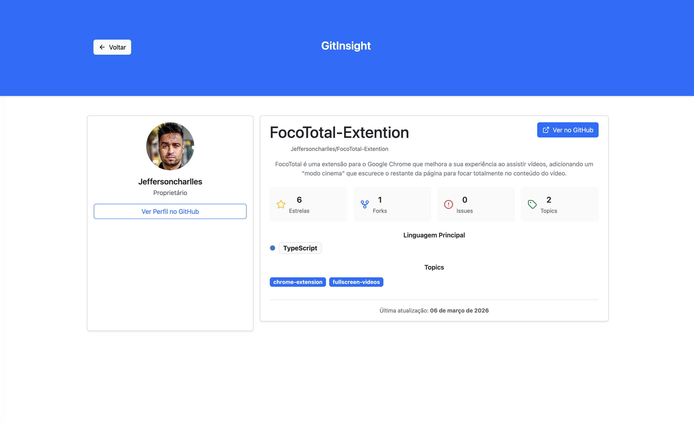

# GitInsight 🔍

O GitInsight é uma plataforma de exploração de dados do GitHub, projetada para oferecer uma experiência fluida na busca de perfis e análise detalhada de repositórios. A aplicação prioriza performance, tipagem estática e experiência do usuário (UX).

## 🌐 Preview

[](https://git-insight-peach.vercel.app/)

[Abrir GitInsight Preview](https://git-insight-peach.vercel.app/)

## 🚀 Diferenciais Técnicos (Arquitetura)

Este projeto foi construído seguindo as melhores práticas de Engenharia de Software modernas:

- Code Splitting & Lazy Loading: utilização de React.lazy e Suspense para otimizar o carregamento inicial (Bundle Size).
- Data Fetching & Cache: orquestração de estado assíncrono com TanStack Query (v5), garantindo cache inteligente e zero requisições desnecessárias.
- Skeleton Architecture: implementação de Skeleton Screens para um carregamento progressivo e agradável, evitando Layout Shifts.
- Validação Rigorosa de Dados: uso de Zod para validar o schema das APIs do GitHub, garantindo resiliência contra dados inesperados.
- Testes Automatizados: cobertura com Jest e Testing Library para garantir consistência dos dados exibidos e reduzir regressões.
- Single Source of Truth (URL): sincronização do estado da busca diretamente com os Search Params da URL, permitindo compartilhamento de links e histórico de navegação funcional.
- Compound Components: componentes de UI (Input e Button) baseados no padrão de composição para máxima flexibilidade e reutilização.

## 📸 Demonstração

Espaço reservado para os prints da Home, Busca e Detalhes.

<p align="center">
  
  
  
</p>

## 🛠️ Tecnologias e Ecossistema

### Core & Tooling

- Vite 8 + React 19: o estado da arte em performance de desenvolvimento.
- TypeScript: tipagem completa para segurança em tempo de compilação.
- Biome: tooling de alta performance para lint e formatação.
- Plugin e tipagens: @vitejs/plugin-react, @types/react, @types/react-dom e @types/node.

### Bibliotecas de Negócio

- TanStack Query (v5): gerenciamento de estado de servidor.
- React Hook Form + @hookform/resolvers + Zod: gestão de formulários e validação de esquemas.
- React Router 7: roteamento robusto com suporte a parâmetros dinâmicos.
- Axios: cliente HTTP configurado com base unitária.
- Bootstrap 5 + Lucide React: interface responsiva e iconografia moderna.
- clsx: composição condicional de classes para estilização.

## ⚙️ Ambiente e Execução

### 1. Instalação

```bash
git clone https://github.com/SEU-USUARIO/GitInsight.git
cd GitInsight
pnpm install
```

### 2. Configuração

Crie o arquivo `.env` com base no `.env.example`:

```bash
cp .env.example .env
```

```env
VITE_API_BASE_URL=https://api.github.com
```

### 3. Rodar o Projeto

```bash
pnpm dev
```

Acesse em `http://localhost:5173`.

### 4. Build de Produção

```bash
pnpm build
```

### 5. Preview da Build

```bash
pnpm preview
```

## 🏗️ Estrutura de Pastas

O projeto utiliza uma estrutura modular visando escalabilidade:

- `src/components/ui`: átomos e componentes de interface base.
- `src/services`: camada de infraestrutura e tipos da API.
- `src/pages/[nome]/hooks`: lógica de negócio (hooks) encapsulada por domínio.
- `src/pages/[nome]/components`: componentes específicos (containers) daquela funcionalidade.

Desenvolvido com foco em qualidade por Jefferson Charlles.
